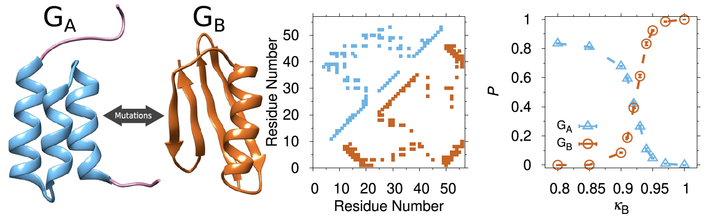
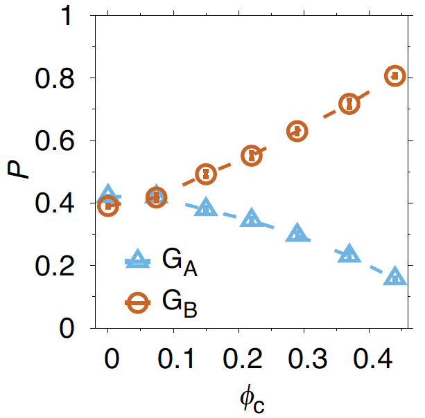

# Cα model: Coarse-Grained Protein Folding and Fold Switching Simulations

This C code implements a one bead-per-amino acid coarse-grained
model for protein folding and protein fold switching, with a structure-based potential.
Conformational sampling is carried out using Langevin dynamics.

This repository developed in the [Wallin Lab](https://www.physics.mun.ca/~jswallin/index.html) under the supervision of **Dr. Stefan Wallin**, this model allows researchers to study **protein folding, fold switching, and particularly macromolecular crowding effects** on proteins.

## How to cite

If you use the Cα model or build upon it in your own work, please cite the following publications:

1. Simulations of a protein fold switch reveal crowding-induced population shifts driven by disordered regions
S Bazmi, B Seifi, S Wallin
Communications Chemistry 6, 191 (2023)
[Read on Nature](https://www.nature.com/articles/s42004-023-00995-2)

This study uses the Cα model to explore how macromolecular crowding impacts protein fold switching, revealing the role of intrinsically disordered regions in driving population shifts between conformational states.

2. Conformational entropic barriers in topology-dependent protein folding: perspectives from a simple native-centric polymer model
S Wallin, H.S. Chan
Journal of Physics: Condensed Matter 18, S307–S328 (2006)
[Link to paper](https://iopscience.iop.org/article/10.1088/0953-8984/21/32/329801/pdf)

This foundational paper outlines the theoretical framework behind structure-based coarse-grained protein models and insights into entropic barriers and folding pathways using native-centric approaches.

## Files and definitions:

🔧 defs.h:

Defines constants, flags, file paths (input and output), simulation and molecular dyanamics parameters. This includes force-field selections (FF_BOND, FF_CONT, ...), temperature parameters, sampling parameters, and filenames for input/output. 

🔧 global.h

Declares all global variables and arrays used across different modules (positions, velocities, forces, energy terms, etc.). This allows consistent access to simulation state across files such as geometry.c, energy.c, etc.

🔧 geometry.c

Handles the spatial representation of chains and crowders. Computes distances, transforms coordinates into the periodic box, and acting on degrees of freedom (bonds, angles, torsions) in Cartesian coordinates. It ensures molecules remain within the simulation boundaries, also.

🔧 energy.c

Implements all energy and force calculations for molecular interactions, including bonds, angles, torsions, native contacts, and crowding effects. For example, it provides functions like bond(), cont(), crowd_bead(), and crowd_crowd() to compute interaction potentials and apply forces.

🔧 obs.c

Computes observables like number of native contacts (no_cont), RMSD, radius of gyration, and histograms for bond lengths, angles, and contact maps. These are used to analyze simulation trajectories and structural properties.

🔧 misc.c

Provides utility functions for simulation and control settings. It includes initialization (printinfo()), output of averages, checkpoint saving/loading (write_checkpnt()), and trajectory exports (dumppdb()).

🔧 utils.c

Handles file-based input like reading native structure files, contact maps, and writing PDB files. Also includes custom random number generators (ran3n) and PDB format export for visualization.

🔧 sampling.c

Implements the Langevin dynamics integrator and simulated tempering routine. It handles probabilistic temperature swapping in the simulated tempering scheme, enabling enhanced conformational sampling across temperature landscapes.

🔧 main_fixtemp.c

Main simulation driver for fixed-temperature molecular dynamics. It runs Langevin dynamics at a single temperature, periodically sampling observables and saving system configurations.

🔧 main_simtemp.c

Simulation driver for simulated tempering protocol. It includes temperature flipping based on Metropolis-Hastings algorithm and adaptive weight updates (update_g). Enables exploration of conformational space by dynamically switching temperatures (Marinari and Parisi, 1992)[Link to paper](https://iopscience.iop.org/article/10.1088/0953-8984/21/32/329801/pdf). 

📌 A minimal sequence of commands to compile the code and run a
simulation of a single chain at a fixed (and several) temperature is:

make constants

./constants input 1

make fixtemp (simtemp)

./main

## Results

🎯 Communications Chemistry 6, 191 (2023)

 
Simulating the GA/GB fold-switch system. a Representative experimental structures of the GA and GB folds shown in ribbon: GA95 (PDB id 2KDL; blue) and GB95 (PDB id 2KDM; orange). In GA95, residue positions 1-7 and 53-56 are intrinsically disordered (purple). b Contact maps of the GA95 (above
diagonal) and GB95 (below diagonal) structures. c Population P of the GA (triangles) and GB (circles) folds as functions of the GB contacts strength, κB.
 

Contact: Stefan Wallin, swallin@mun.ca

